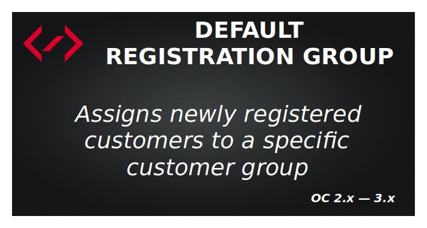
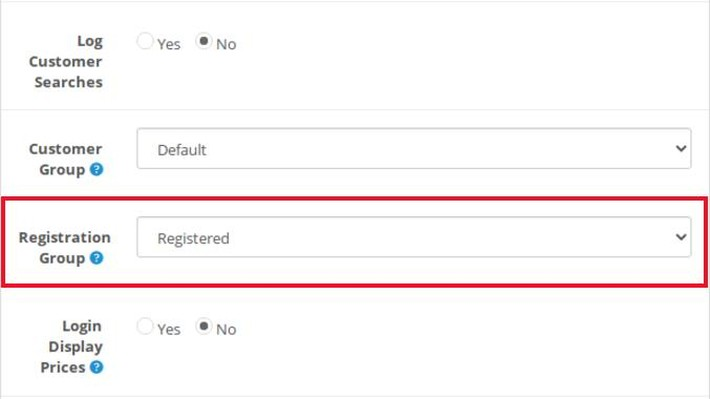
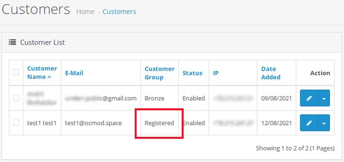

# Default Registration Group

## Description
The "Default Registration Group" extension is for Opencart CMS 2.x-3.x. It allows to automatically assign a specific customer group to newly registered customers.

## Features
* Automatically assigns newly registered customers to a specific customer group
* Does not change OC core files due to using OCMOD Modification System

## Screenshots

## Live demo
[Front](http://ocmod.freevar.com/oc3020/a/mp3-players) - register and get a 5% discount

## License
[End-User License Agreement](https://raw.githubusercontent.com/ocmod-space/license/main/EULA.txt)

## Links
* [Opencart Marketplace](https://www.opencart.com/index.php?route=marketplace/extension/info&extension_id=42480)
* [GitHub](https://github.com/ocmod-space/ocmod-default-registration-group)

